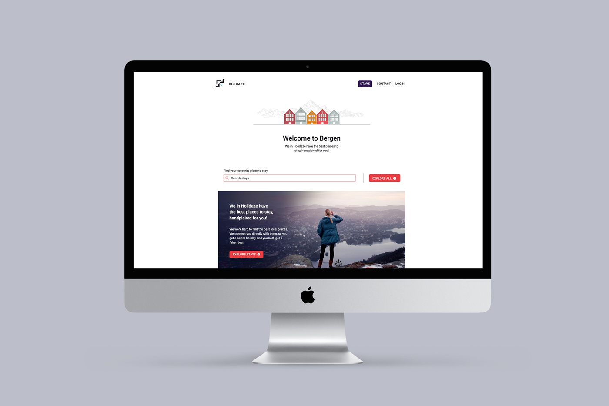

## Getting Started

This is a [Next.js](https://nextjs.org/) project bootstrapped with [`create-next-app`](https://github.com/vercel/next.js/tree/canary/packages/create-next-app).

This repo is a copy of my final exam.

### Installing

1. Clone the repo:

```bash
git clone git@github.com:Iselinklementin/project_exam22
```

2. Install the dependencies:

```
npm install
```

### Running

To run the app, run the following commands:

```bash
npm run dev
```

Make sure to open a pull request so code can be reviewed.
Open [http://localhost:3000](http://localhost:3000) with your browser to see the result.

## Built With

 


- [yup](https://www.npmjs.com/package/yup)
- [react-select](https://react-select.com/home)
- [axios](https://github.com/axios/axios)
- [react-hook-form](https://react-hook-form.com/)
- [react datepicker](https://reactdatepicker.com/)
- [Wordpress rest API](https://developer.wordpress.org/rest-api/)


# Project Exam 2

## Goal

To take the skills learned over the last two years and take on an extensive project where the finished product should reflect the candidate's general development capabilities, in addition to visual and technical skills.

### Brief

The final submission must have the following:

- A Gantt chart planning the project
- A style guide
- An Adobe XD prototype
- Use a CSS Pre-processor and BEM if not using CSS Modules, Styled Components, etc
- Use a React.js or Next.js
- You can use regular JS or TypeScript
- Please use create-react-app or create-next-app to generate a skeleton project for yourself
- A fully working website that fulfils the brief

### Hotel Booking Website

A local tourism agency in Bergen is launching a new website called ‘Holidaze’ for visitors to the area to be able to find hotels, B&Bs and guesthouses, and for the accommodation owners to receive enquiries.

The project requires you to create the visitor side of the website where users can search accommodation and make enquiries, as well as the administration side where properties can be added and enquiries managed.

You will need to create an API to store the data for the establishments, enquiries and contact submissions. You can choose to use WordPress or Strapi as a Headless CMS, but it is very important that the API is deployed and publicly available. Please do not submit any files for your API. Only submit the website you have created.

### Requirements for the Website

#### Visitor Side

- Homepage
- Search bar typeahead (auto dropdown with hotel names that match what has been typed)
- A results page with all hotels
- The hotel specific page which displays all details about the hotel
- An enquiry page either modal or separate page
- A contact page (different to enquiry page) which goes to the admin for Holidaze

#### Admin side

- Create a login section that makes use of JWT tokens
- List of enquiries and new enquiries appear when user submits the form on the enquiry page
- List of messages from contact form
- The admin can create a new establishment

#### Level 1 Process

- Start by planning out the project.
- Next begin your research of likely users and browse competitor websites for ideas.
- Create a style guide
- Build an Adobe XD prototype (or you can use Sketch or Figma).
- Start coding.
- Once you’ve finished development, start looking for bugs and ensure the site functions well on all viewports. Test the code on different devices. Because your API is public, the code shouldn’t rely on a local API.
- Refactor your code.
- Ask another student to look over your code and ask them if they can see how it might be better implemented. This is important to get an outside view on your code. Please attach this feedback to your report.
- Add the login details for your admin side at the top of this README.md file so that it's easy for the marker to spot.

---

#### Login details

```bash
This is not added on public repo
```
---

### Contact

[](https://www.linkedin.com/in/iselinhaugen)

Or you can take a look at my 👩🏼‍💻 [portfolio](https://iselinklementin.netlify.app/).
